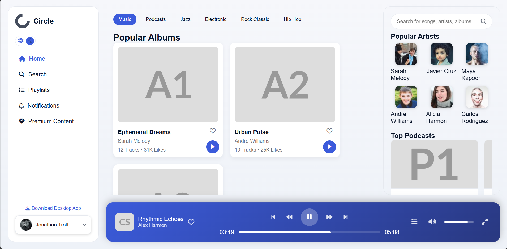
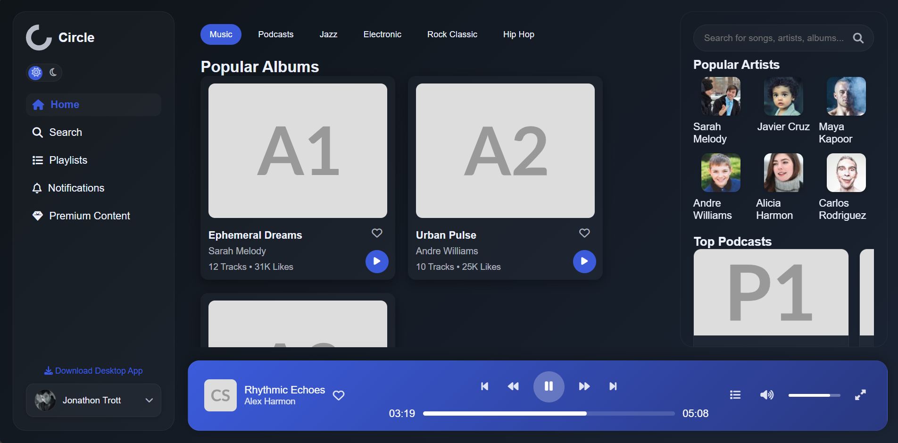

# 🎧 Circle Music Player UI

> **Exercise 2** – Course: **Web Application Analysis and Development**  
> **Task:** Apply the following techniques to enhance your user interface:  
> - Responsive UI Design  
> - Transitions  
> - Animations  
**Developed by:** Nguyen Vu Hoang Long 
**ID Student:** 23090026
---

##  Overview

The **Circle Music Player** project is a front-end interface created as part of the *Web Application Analysis and Development* course.  
This exercise aims to **recreate the provided UI design** and enhance it with modern front-end techniques for a smooth, responsive, and interactive experience.

Key features include:
- Fully **responsive layout** for desktop, tablet, and mobile  
- **Smooth transitions** and **hover effects**  
- **Animated UI components** for better user engagement  
- A **Light/dark mode toggle**  
- **Clean and modular CSS structure**


## Project Structure

```bash
MusicPlayist/
│
├── index.html
├── css/
│   ├── base.css          # Base styles, resets, fonts, and color variables
│   ├── layout.css        # Defines the main layout structure (grid, sidebar, content)
│   ├── components.css    # Reusable UI components (cards, buttons, navigation, etc.)
│   ├── theme.css         # Manages light/dark theme styling
│   ├── transition.css    # Handles all transitions, hover, and animation effects
│   └── responsive.css    # Ensures proper layout on various screen sizes
├── assets/
│   ├── icons/ 
│   └── images/
└── README.md
```


###  Interface Layout Structure

The "Circle Music Player" interface includes two modes: **Light Mode** and **Dark Mode**.

#### Light Mode:


#### Dark Mode:



The interface is divided into four main sections:

| Section                | Main Content                   | Suggested Technique      |
| ---------------------- | ------------------------------ | ------------------------ |
| **Left Sidebar**       | Logo, Menu, User               | Flexbox (column layout)  |
| **Main Content**       | Albums, Playlist, Recent       | CSS Grid                 |
| **Right Sidebar**      | Search, Artist, Podcast, Queue | Flexbox / Grid           |
| **Footer (Player)**    | Fixed music player bar         | Flexbox + Fixed Position |